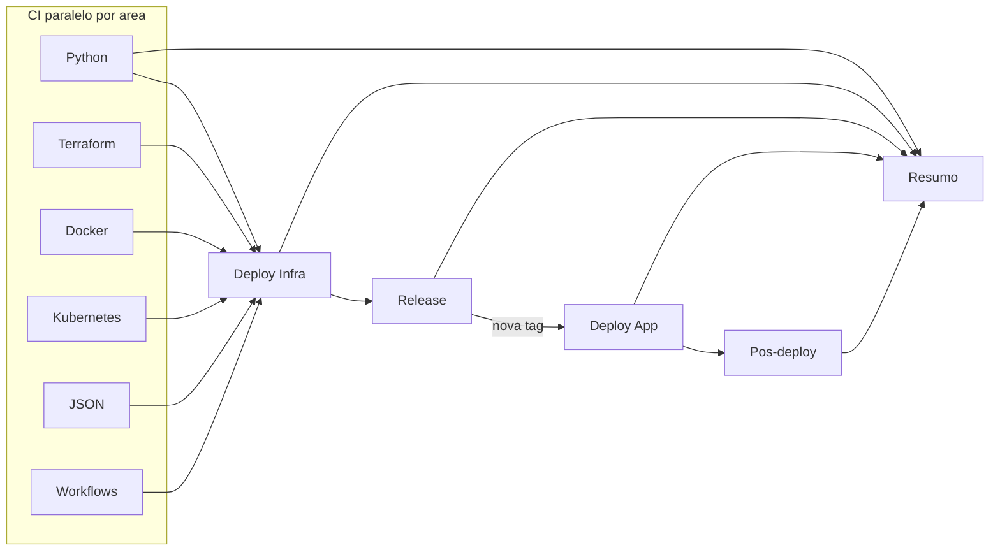

# GitHub Actions

Pipelines de integracao, entrega e destroy da stack Minecraft Server na Azure.

## Visao do pipeline (push em `main`)



| Fase | Job | Notas |
|------|-----|-------|
| CI | Python / Terraform / Docker / Kubernetes / JSON / Workflows | Mesmo orquestrador do pre-commit |
| CD infra | Deploy Infra condicional | `paths-filter`, `[skip-cd]`, `[force-infra]` |
| Release | Semantic release | Apos gates + infra OK |
| CD app | Deploy App | Environment `production` |
| Verificacao | Pos-deploy | Saude K8s + TCP |

## Workflows

| Workflow | Gatilho | Uso |
|----------|---------|-----|
| [ci.yml](workflows/ci.yml) | push/PR `main`, manual | CI matriz; CD no push `main` |
| [cd.yml](workflows/cd.yml) | release externa, manual | Re-deploy sob demanda |
| [destroy.yml](workflows/destroy.yml) | manual | Remocao controlada |

## Composite actions

```text
.github/actions/
├── shared/
│   ├── azure-login/
│   ├── aks-context/
│   ├── resolve-whitelist/
│   └── pipeline-summary/
├── ci/                       lint-code, test, security, validate-*, lint-infra=actionlint
├── cd/
└── destroy/azure/
```

## Secrets

| Secret | Uso |
|--------|-----|
| `AZURE_CLIENT_ID` | OIDC (obrigatorio) |
| `AZURE_TENANT_ID` | Azure / Terraform ARM |
| `AZURE_SUBSCRIPTION_ID` | Azure / Terraform ARM |
| `RCON_PASSWORD` | Secret `mc-rcon` |
| `MINECRAFT_WHITELIST` | Secret `mc-access` |
| `GITHUB_TOKEN` | Release e Gitleaks |

## Environments

| Environment | Uso |
|-------------|-----|
| `production` | Deploy app + pos-deploy |
| `production-infra` | Terraform apply |
| `production-destroy` | Destroy |

## Operacao

### Push em `main`

1. CI paralelo por area (matriz Lint/Validate/Testes/Seguranca).
2. Infra: apply se TF mudou, AKS ausente, `[force-infra]` ou `force_infra`.
3. Release e deploy app se houver tag nova.
4. Marcador `[skip-cd]`: so CI; sem infra/release/deploy.

### Pull request

Somente jobs CI por area (sem CD).

Documentacao: [docs/devops.md](../docs/devops.md), [docs/engineering-python.md](../docs/engineering-python.md), [docs/azure.md](../docs/azure.md).
