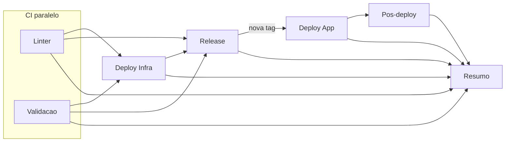

# GitHub Actions

Pipelines de integracao, entrega e destroy da stack Minecraft Server na Azure.

## Visao do pipeline (push em `main`)



| Fase | Job | Boas praticas aplicadas |
|------|-----|-------------------------|
| CI | Linter + Validacao em paralelo | Feedback rapido; PR executa so CI |
| CD infra | Deploy Infra condicional | `paths-filter`, environment `production-infra`, OIDC |
| Release | Semantic release apos gates | So com linter/validate/infra OK |
| CD app | Deploy App | Environment `production`, imagem imutavel por tag, cache GHA |
| Verificacao | Pos-deploy | Saude K8s, TCP 25565, annotations no Summary |

## Workflows

| Workflow | Gatilho | Uso |
|----------|---------|-----|
| [ci.yml](workflows/ci.yml) | push/PR `main`, manual | CI completo; CD automatico no push `main` |
| [cd.yml](workflows/cd.yml) | release externa, manual | Re-deploy ou infra sob demanda |
| [destroy.yml](workflows/destroy.yml) | manual | Remocao controlada |

## Composite actions

```text
.github/actions/
├── shared/
│   ├── azure-login/          OIDC ou service principal
│   ├── aks-context/          kubectl no AKS prod
│   ├── resolve-whitelist/    UUID offline para modo offline
│   └── pipeline-summary/     Tabela no GitHub Summary
├── ci/                       lint, test, security, validate, release
├── cd/                       deploy-infra, deploy-app, post-deploy
└── destroy/azure/
```

## Secrets

| Secret | Uso |
|--------|-----|
| `AZURE_CLIENT_ID` | OIDC (recomendado) |
| `AZURE_TENANT_ID` | Azure / Terraform ARM |
| `AZURE_SUBSCRIPTION_ID` | Azure / Terraform ARM |
| `AZURE_CREDENTIALS` | Fallback JSON service principal |
| `RCON_PASSWORD` | Secret `mc-rcon` no AKS |
| `MINECRAFT_WHITELIST` | Secret `mc-access` (padrao `AnonymousNoobz` se ausente) |
| `GITHUB_TOKEN` | Release e Gitleaks (automatico) |

## Environments

| Environment | Uso | Protecao recomendada |
|-------------|-----|----------------------|
| `production` | Deploy app + pos-deploy | Reviewers |
| `production-infra` | Terraform apply | Reviewers + confirmar `APPLY_INFRA` |
| `production-destroy` | Destroy | Reviewers + `DESTROY` |

## Operacao

### Push em `main`

1. CI paralelo: linter + validacao (testes, seguranca, Docker/K8s/TF).
2. Infra: apply so se TF mudou, AKS ausente, `[force-infra]` no commit ou input manual `force_infra`.
3. Release: nova tag quando houver commits releasable.
4. Deploy: build com cache GHA, rollout AKS, pos-deploy com probe TCP.

### Pull request

Apenas jobs **CI - Linter** e **CI - Validacao** (sem deploy).

### Manual

- **CI workflow**: `skip_cd=true` roda so qualidade (sem release/deploy).
- **CD workflow**: modos `deploy-app`, `deploy-infra`, `deploy-app-and-verify`.

### Conectar ao servidor

Annotation `minecraft-server.io/conectividade-endereco` no Service `mc-server-game` (atualizada no pos-deploy).

Documentacao: [docs/devops.md](../docs/devops.md), [docs/azure.md](../docs/azure.md).
