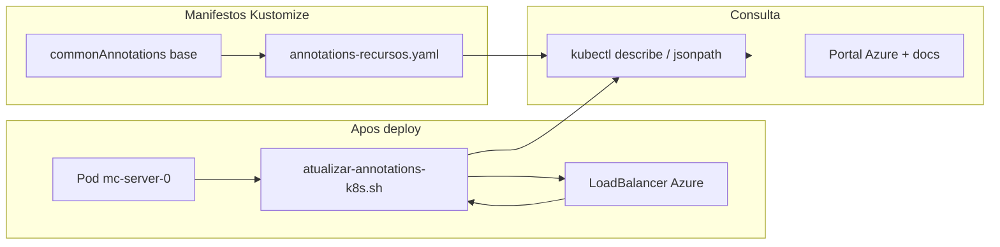
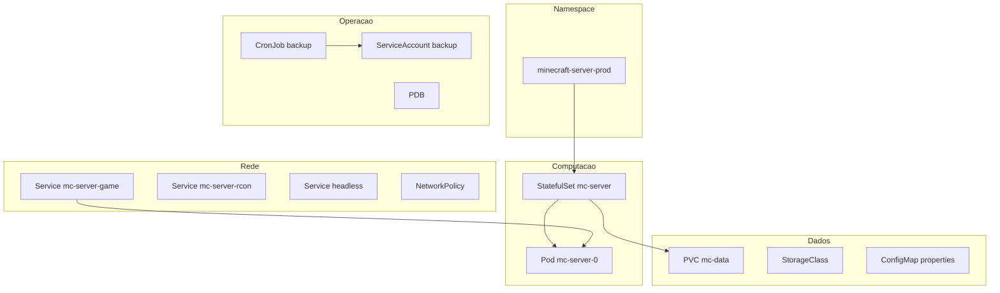

# Annotations Kubernetes

Referencia das metadados `minecraft-server.io/*` e integracao com Azure Workload Identity no namespace `minecraft-server-prod`.

## Fluxo de metadados



| Origem | Quando | O que define |
|--------|--------|--------------|
| `infra/kubernetes/base/kustomization.yaml` | `kubectl apply -k` | Azure, projeto, links de documentacao (todos os recursos do overlay) |
| `infra/kubernetes/overlays/prod/patches/annotations-recursos.yaml` | `kubectl apply -k` | Minecraft, PVC, servicos, backup, rede (por tipo de recurso) |
| `app/scripts/bash/atualizar-annotations-k8s.sh` | CD, pos-deploy, `make k8s-annotate` | Host/IP, saude TCP, logs, fase do pod, timestamp |
| `azure.workload.identity/client-id` | SA `mc-world-backup` | Client ID da UAMI (substituido no CD) |

## Consulta rapida

Endereco para jogar:

```bash
kubectl -n minecraft-server-prod get svc mc-server-game \
  -o jsonpath='{.metadata.annotations.minecraft-server\.io/conectividade-endereco}{"\n"}'
```

Listar todas as chaves `minecraft-server.io` de um recurso:

```bash
kubectl -n minecraft-server-prod get statefulset mc-server -o json | \
  jq -r '.metadata.annotations | to_entries[] | select(.key | startswith("minecraft-server.io/")) | "\(.key)=\(.value)"'
```

Atualizar valores dinamicos:

```bash
make k8s-annotate
```

## Catalogo por categoria

### Plataforma e documentacao (commonAnnotations)

Aplicadas a todos os recursos do overlay via `kustomization.yaml` base.

| Chave | Valor tipico | Descricao |
|-------|--------------|-----------|
| `minecraft-server.io/projeto` | `minecraft-server` | Nome do projeto |
| `minecraft-server.io/ambiente` | `prod` | Ambiente |
| `minecraft-server.io/gerenciado-por` | `kustomize-terraform` | Ferramentas de entrega |
| `minecraft-server.io/documentacao-operacoes` | `docs/operations.md` | Guia operacional |
| `minecraft-server.io/documentacao-azure` | `docs/azure.md` | Guia Azure / Terraform |
| `minecraft-server.io/documentacao-acesso` | `docs/access-and-hostname.md` | Acesso e hostname |

### Azure (commonAnnotations)

| Chave | Valor tipico | Recurso Azure |
|-------|--------------|---------------|
| `minecraft-server.io/azure-regiao` | `brazilsouth` | Regiao |
| `minecraft-server.io/azure-resource-group` | `rg-minecraft-server-prod` | Resource group |
| `minecraft-server.io/azure-aks-cluster` | `aks-minecraft-server-prod` | AKS |
| `minecraft-server.io/azure-acr` | `acrminecraftserverprod` | Container Registry |
| `minecraft-server.io/azure-storage-account` | `stminecraftserverprod001` | Storage account |
| `minecraft-server.io/azure-container-backup` | `world-backups` | Container blob backups |
| `minecraft-server.io/azure-container-tfstate` | `tfstate` | Container blob Terraform state |
| `minecraft-server.io/azure-identidade-backup` | `id-mc-world-backup-prod` | User-assigned identity |
| `minecraft-server.io/azure-dns-label-padrao` | `minecraftserverprod` | DNS label do LB |

### Minecraft e servidor (StatefulSet + pod template)

| Chave | Valor tipico | Recurso K8s |
|-------|--------------|-------------|
| `minecraft-server.io/jogo-versao` | `1.20.6` | StatefulSet, Pod |
| `minecraft-server.io/jogo-tipo` | `FABRIC` | StatefulSet, Pod |
| `minecraft-server.io/jogo-porta` | `25565` | StatefulSet, Pod, Service game |
| `minecraft-server.io/jogo-porta-rcon` | `25575` | StatefulSet, Service rcon |
| `minecraft-server.io/jogo-memoria` | `2G` | StatefulSet |
| `minecraft-server.io/jogo-max-jogadores` | `20` | StatefulSet |
| `minecraft-server.io/jogo-dificuldade` | `hard` | StatefulSet |
| `minecraft-server.io/jogo-online-mode` | `true` | StatefulSet |
| `minecraft-server.io/jogo-whitelist` | `true` | StatefulSet |
| `minecraft-server.io/jogo-aikar-flags` | `true` | StatefulSet |
| `minecraft-server.io/container-principal` | `mc-server` | Pod template |
| `minecraft-server.io/acesso-rcon` | comando port-forward | StatefulSet |

### Saude e probes (estatico + dinamico)

| Chave | Origem | Valores dinamicos possiveis |
|-------|--------|----------------------------|
| `minecraft-server.io/saude-startup-probe` | Estatico | `tcp:25565` |
| `minecraft-server.io/saude-liveness-probe` | Estatico | `tcp:25565` |
| `minecraft-server.io/saude-readiness-probe` | Estatico | `tcp:25565` |
| `minecraft-server.io/saude-statefulset` | Script | `pronto`, `aguardando (0/1)` |
| `minecraft-server.io/saude-replicas-prontas` | Script | `1/1` |
| `minecraft-server.io/saude-tcp-externa` | Script | `acessivel`, `indisponivel`, `sem-host-publico` |
| `minecraft-server.io/saude-logs` | Script | `online`, `iniciando`, `pod-ausente` |
| `minecraft-server.io/saude-fase` | Script | Fase PVC ou Pod (`Running`, `Bound`, etc.) |
| `minecraft-server.io/saude-ready` | Script | `True` / `False` (Pod) |
| `minecraft-server.io/saude-pvc` | Script | Fase do PVC |
| `minecraft-server.io/saude-servico` | Script | `clusterip-interno` (RCON) |
| `minecraft-server.io/saude-backup-cronjob` | Script | `ultimo-job-ok`, `sem-job-ainda`, etc. |
| `minecraft-server.io/saude-ultimo-job` | Script | CronJob backup |
| `minecraft-server.io/atualizado-em` | Script | ISO8601 UTC |

### Conectividade (dinamico)

| Chave | Descricao | Recursos anotados |
|-------|-----------|-------------------|
| `minecraft-server.io/conectividade-host` | Hostname ou IP do LB | Namespace, Service game, StatefulSet |
| `minecraft-server.io/conectividade-ip` | IP publico se existir | Namespace, Service game |
| `minecraft-server.io/conectividade-endereco` | **Endereco para o cliente Minecraft** | Namespace, Service game, StatefulSet, Pod |
| `minecraft-server.io/conectividade-porta` | `25565` | Namespace, Service game, Pod |
| `minecraft-server.io/conectividade-loadbalancer` | `ativo` ou `pendente` | Namespace, Service game |
| `minecraft-server.io/conectividade-protocolo` | `tcp` | Service game (estatico) |
| `minecraft-server.io/conectividade-instrucao` | Texto de ajuda | Service game (estatico) |
| `minecraft-server.io/azure-dns-fqdn-esperado` | FQDN Azure cloudapp | Service game |

### Armazenamento

| Chave | Recurso | Descricao |
|-------|---------|-----------|
| `minecraft-server.io/pvc-dados` | StatefulSet | Nome do PVC |
| `minecraft-server.io/pvc-tamanho` | StatefulSet, PVC | `32Gi` |
| `minecraft-server.io/pvc-storage-class` | StatefulSet | `mc-standard-ssd` |
| `minecraft-server.io/pvc-reclaim-policy` | StatefulSet | `Retain` |
| `minecraft-server.io/armazenamento-tipo` | PVC | AzureDisk StandardSSD |
| `minecraft-server.io/armazenamento-tamanho` | PVC | `32Gi` |
| `minecraft-server.io/dados-world` | PVC | Caminho mundo |
| `minecraft-server.io/dados-mods` | PVC | Caminho mods |
| `minecraft-server.io/dados-logs` | PVC | Caminho logs |
| `minecraft-server.io/provisioner` | StorageClass | CSI Azure disk |
| `minecraft-server.io/azure-sku` | StorageClass | `StandardSSD_LRS` |
| `minecraft-server.io/reclaim-policy` | StorageClass | `Retain` |

### Servicos Kubernetes

| Chave | Service | Valor |
|-------|---------|-------|
| `minecraft-server.io/servico-tipo` | game / rcon / headless | `LoadBalancer` ou `ClusterIP` |
| `minecraft-server.io/servico-headless` | headless | `true` |
| `minecraft-server.io/statefulset` | headless, PDB | `mc-server` |
| `minecraft-server.io/acesso` | rcon | `port-forward-clusterip` |
| `minecraft-server.io/acesso-comando` | rcon | Comando kubectl completo |

### Backup

| Chave | Recurso | Descricao |
|-------|---------|-----------|
| `minecraft-server.io/backup-agendamento` | CronJob | Cron `0 3 * * *` |
| `minecraft-server.io/backup-fuso` | CronJob | `America/Sao_Paulo` |
| `minecraft-server.io/backup-destino-conta` | CronJob | Storage account |
| `minecraft-server.io/backup-destino-container` | CronJob | `world-backups` |
| `minecraft-server.io/backup-origem` | CronJob | `/data/world` |

### Rede e configuracao

| Chave | Recurso | Descricao |
|-------|---------|-----------|
| `minecraft-server.io/rede-ingress-jogo` | NetworkPolicy | TCP 25565 |
| `minecraft-server.io/rede-ingress-rcon` | NetworkPolicy | TCP 25575 |
| `minecraft-server.io/rede-egress-dns` | NetworkPolicy | Porta 53 |
| `minecraft-server.io/rede-egress-https` | NetworkPolicy | Porta 443 |
| `minecraft-server.io/disrupcao-min-available` | PDB | `0` |
| `minecraft-server.io/config-tipo` | ConfigMap | `server-properties` |
| `minecraft-server.io/config-mount` | ConfigMap | Caminho no container |
| `minecraft-server.io/papel` | Namespace | `ambiente-producao` |
| `minecraft-server.io/kubernetes-namespace` | Namespace | Nome do namespace |

### Azure nativo (Workload Identity)

| Chave | Recurso | Descricao |
|-------|---------|-----------|
| `azure.workload.identity/client-id` | ServiceAccount `mc-world-backup` | Client ID da UAMI apos CD |

Annotation de plataforma Azure (nao prefixo `minecraft-server.io`):

| Chave | Recurso | Descricao |
|-------|---------|-----------|
| `service.beta.kubernetes.io/azure-dns-label-name` | Service `mc-server-game` | Label DNS gratuito no LB |

## Recursos por tipo (resumo)



| Kind | Nome | Annotations estaticas | Dinamicas |
|------|------|----------------------|-----------|
| Namespace | `minecraft-server-prod` | common + papel | conectividade, saude agregada |
| StatefulSet | `mc-server` | common + jogo + PVC + probes | saude, conectividade |
| Pod | `mc-server-0` | template jogo | fase, ready, logs, TCP, endereco |
| Service | `mc-server-game` | common + LB + DNS | host, IP, endereco, TCP |
| Service | `mc-server-rcon` | common + ClusterIP | saude-servico |
| Service | `mc-server-headless` | common + headless | — |
| PVC | `mc-data` | common + armazenamento | saude-fase |
| StorageClass | `mc-standard-ssd` | common + provisioner | — |
| CronJob | `mc-world-backup` | common + backup | saude-ultimo-job |
| ServiceAccount | `mc-world-backup` | WI client-id | — |
| NetworkPolicy | `mc-server-netpol` | common + rede | — |
| ConfigMap | `mc-server-properties` | common + config | — |
| PDB | `mc-server-pdb` | common + PDB | — |

## Automacao

| Gatilho | Acao |
|---------|------|
| `make k8s-apply` | Apply + `atualizar-annotations-k8s.sh` |
| `make k8s-annotate` | Somente script de atualizacao |
| CD `deploy-app` | Apos `rollout status` |
| CD `post-deploy` | Antes de `test-aks.sh` |
| `test-aks.sh` | Ao final (se kubectl disponivel) |

## Manutencao

Ao alterar versao do Minecraft, regiao, nomes Azure ou agendamento de backup:

1. Atualize `annotations-recursos.yaml` e/ou `statefulset.yaml`
2. Atualize `commonAnnotations` em `kustomization.yaml` se mudar recursos Azure globais
3. Atualize este arquivo (`docs/annotations.md`)
4. Rode `make k8s-apply` ou `make k8s-annotate` no cluster

Ver tambem: [operations.md](operations.md), [architecture.md](architecture.md), [azure.md](azure.md).
