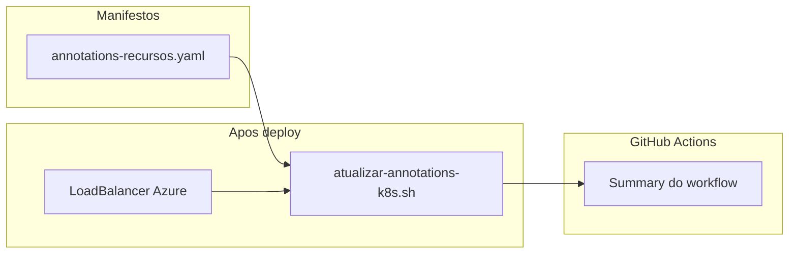
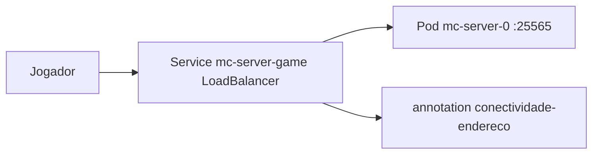

# Annotations Kubernetes

Metadados `minecraft-server.io/*` essenciais (conectividade, saude, jogo e documentacao). Backup automatico esta desativado no Free tier — nao ha chave de cron nem ServiceAccount de backup.

## Fluxo de metadados



| Origem | Quando | O que define |
|--------|--------|--------------|
| `infra/kubernetes/overlays/prod/patches/annotations-recursos.yaml` | `kubectl apply -k` | Ambiente, jogo, DNS, doc |
| `app/scripts/bash/atualizar-annotations-k8s.sh` | CD, `make k8s-annotate` | Host, endereco, LB, saude TCP/logs, timestamp |
| `app/scripts/bash/publicar-annotations-github.sh` | CI e CD | Tabela resumida no Summary do GitHub |

## GitHub Actions (onde ver no portal)

O painel **Annotations** do job mostra avisos do runner. O resumo operacional esta na aba **Summary**.

## Catalogo essencial

| Chave | Informacao no Summary | Estatico / dinamico |
|-------|----------------------|---------------------|
| `minecraft-server.io/ambiente` | Ambiente | Estatico |
| `minecraft-server.io/conectividade-endereco` | Endereco Minecraft | Dinamico |
| `minecraft-server.io/conectividade-host` | Host publico | Dinamico |
| `minecraft-server.io/conectividade-loadbalancer` | Load Balancer | Dinamico |
| `minecraft-server.io/conectividade-porta` | Porta do jogo | Estatico |
| `minecraft-server.io/saude-tcp-externa` | Porta 25565 TCP | Dinamico |
| `minecraft-server.io/saude-statefulset` | Replicas prontas | Dinamico |
| `minecraft-server.io/saude-logs` | Estado nos logs | Dinamico |
| `minecraft-server.io/jogo-versao` | Versao Minecraft | Estatico |
| `minecraft-server.io/jogo-tipo` | Loader | Estatico |
| `minecraft-server.io/azure-dns-fqdn-esperado` | DNS Azure esperado | Estatico |
| `minecraft-server.io/documentacao-acesso` | Documentacao | Estatico |
| `minecraft-server.io/atualizado-em` | Ultima atualizacao | Dinamico |

## Consulta rapida

```bash
kubectl -n minecraft-server-prod get svc mc-server-game \
  -o jsonpath='{.metadata.annotations.minecraft-server\.io/conectividade-endereco}{"\n"}'
make k8s-annotate
```

## Diagrama de conectividade


