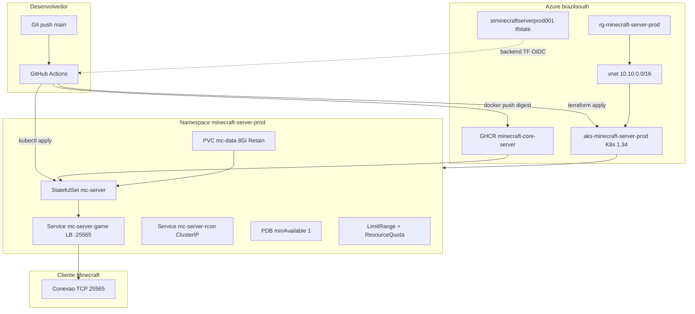
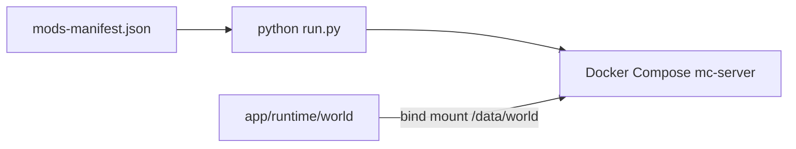

# Arquitetura

Visao da stack completa: codigo do repositorio, entrega local, infraestrutura Azure (Terraform), orquestracao Kubernetes e runtime do servidor Minecraft Fabric.

## Diagrama — producao (Azure AKS)



## Diagrama — desenvolvimento local



Codigo hexagonal: [arquitetura.md](arquitetura.md). Volumes locais: [infra-docker.md](infra-docker.md).

## Camadas do repositorio

| Camada | Pasta / artefato | Responsabilidade |
|--------|------------------|------------------|
| Dominio Python | `app/src/domain` | Entidades e regras do sync de mods |
| Aplicacao Python | `app/src/application` | Use case e ports |
| Infra Python | `app/src/infrastructure` | Adapters HTTP/FS, Settings, log_event |
| Presentation | `app/src/presentation` | CLI e composition root |
| Runtime Fabric | `app/runtime/` | Mundo, configs, JARs, logs, database |
| Entrega local | `infra/docker/` | Dockerfile + Compose |
| IaC | `infra/terraform/live/prod` | AKS + rede (OIDC); imagem via GHCR |
| Runtime cloud | `infra/kubernetes/` | StatefulSet, Services, PDB, NetPol, quotas |

### Regra de dependencia (Clean Architecture)

- `domain` e `application` nao importam `infrastructure` nem `presentation`
- Codigo em `app/src/` nao depende de Terraform nem de YAML do Kubernetes
- Scripts e Makefile dependem de `app/src/`, nunca o contrario
- Manifestos K8s referenciam imagem do **GHCR** por digest e secrets injetados pelo CD

## Mapeamento de volumes

| Host (local) | Pod AKS | Caminho no container | Conteudo |
|--------------|---------|----------------------|----------|
| `app/runtime/world` | subPath `world` | `/data/world` | Chunks, jogadores |
| `app/runtime/configs/server.properties` | ConfigMap | `/data/server.properties` | Politicas (K8s) |
| `app/runtime/mods` | subPath `mods` | `/data/mods` | JARs Fabric |
| `app/runtime/plugins` | subPath `plugins` | `/data/plugins` | Plugins |
| `app/runtime/logs` | subPath `logs` | `/data/logs` | Logs |
| `app/runtime/database` | subPath `database` | `/data/database` | SQLite / auth |

No AKS um unico PVC `mc-data` (**8Gi**, `mc-standard-ssd`, **Retain**) agrupa os subPaths.

## Servidor Minecraft (runtime)

| Parametro | Valor producao (StatefulSet) | Local (`.env`) |
|-----------|------------------------------|----------------|
| Versao | `1.20.6` | `MINECRAFT_VERSION` |
| Loader | `FABRIC` | `SERVER_TYPE` |
| Memoria | overlay prod `1G` (limites no patch) | `MEMORY_LIMIT` |
| Porta jogo | `25565` | `GAME_PORT` |
| RCON | `25575` (ClusterIP no AKS) | `RCON_PORT` (localhost only) |
| Online mode | `false` | `ONLINE_MODE` |
| Whitelist | Secret `mc-access` | `MINECRAFT_WHITELIST` |
| Flags JVM | `USE_AIKAR_FLAGS=true` | idem |
| Probes | startup TCP `25565`; readiness/liveness `mc-health` (paridade Compose) | healthcheck `mc-health` |

Imagem base pinada por digest em `infra/docker/Dockerfile` (`itzg/minecraft-server:java21@sha256:...`), publicada no **GHCR** como `ghcr.io/victorh-silveira/minecraft-core-server:<tag>` e aplicada no cluster por **digest**.

## Infraestrutura Azure (Terraform)

Stack: `infra/terraform/live/prod` (regiao `brazilsouth`).

| Modulo | Recursos principais |
|--------|---------------------|
| `network` | VNet, subnet AKS `10.10.0.0/22`, NSG (Minecraft 25565, RCON opcional, egress) |
| `aks` | Cluster Free tier, 1x `Standard_B2ats_v2`, OIDC + Workload Identity habilitados |

Imagem via **GHCR** (sem ACR no stack). Backup automatico (CronJob + UAMI) esta **desativado** no Free tier; recuperacao via procedimento manual em [operations.md](operations.md) / [azure.md](azure.md).

Storage account `stminecraftserverprod001`: container `tfstate` com versionamento e soft-delete (script `ensure-tfstate-backend.sh`).

Workload Identity no AKS esta ligado para evolucao futura (Key Vault); secrets atuais do jogo vem de GitHub Secrets → `kubectl create secret` no CD.

Versao Kubernetes alinhada ao cluster em `variables.tf` (padrao `1.34`); o modulo AKS ignora drift de versao para evitar downgrade. Pool unico no Free tier (system+workload); segregacao system/user fica para SKU pago.

## Kubernetes (Kustomize)

| Caminho | Uso |
|---------|-----|
| `infra/kubernetes/base/` | Namespace, STS, PVC, Services, ConfigMap, PDB, NetPol, LimitRange, ResourceQuota |
| `infra/kubernetes/overlays/prod/` | Patches de recursos, DNS label do LB, annotations |

Patch `annotations-recursos.yaml` cobre namespace, StatefulSet e Service game.

Script `app/scripts/bash/atualizar-annotations-k8s.sh` preenche conectividade e saude apos deploy. Catalogo: [annotations.md](annotations.md).

## CI/CD (resumo)

| Evento | Efeito |
|--------|--------|
| Push `main` | CI: lint, testes, seguranca, validacao TF/K8s/Docker; deploy infra se TF mudou; release semantica |
| Release publicada | CD: build imagem, push GHCR, Trivy image, rollout AKS por digest, annotations, testes |
| Workflow Destroy manual | Remove namespace K8s, plan/apply destroy Terraform |
| Commit com `[skip-cd]` | Pula apenas jobs de deploy/infra; QA permanece |

Auth Azure: **OIDC obrigatorio** (`AZURE_CLIENT_ID`); sem fallback de service principal.

Detalhes: [devops.md](devops.md) e [.github/README.md](../.github/README.md).

## Sync de mods

Manifesto: `app/runtime/mods/mods-manifest.json`.

```bash
make docker-sync-mods
make app-test
```

Regras senior: SHA-256 obrigatorio apos resolucao, download atomico, backoff HTTP 429/5xx nos adapters. JARs nao entram no Git.

## Scorecard

| Pilar | Nota | Observacao |
|-------|------|------------|
| Separacao codigo / infra | 9/10 | Monorepo claro |
| Producao Azure | 7/10 | Free tier single pool; WI sem Key Vault ainda |
| Persistencia | 7/10 | PVC Retain; backup diario automatico desativado |
| Seguranca padrao | 8/10 | Whitelist + OIDC + digest + Trivy image |
| Metadados operacionais | 9/10 | Annotations `minecraft-server.io/*` |

Ver [devops.md](devops.md) e [engineering-senior-bar.md](engineering-senior-bar.md).
