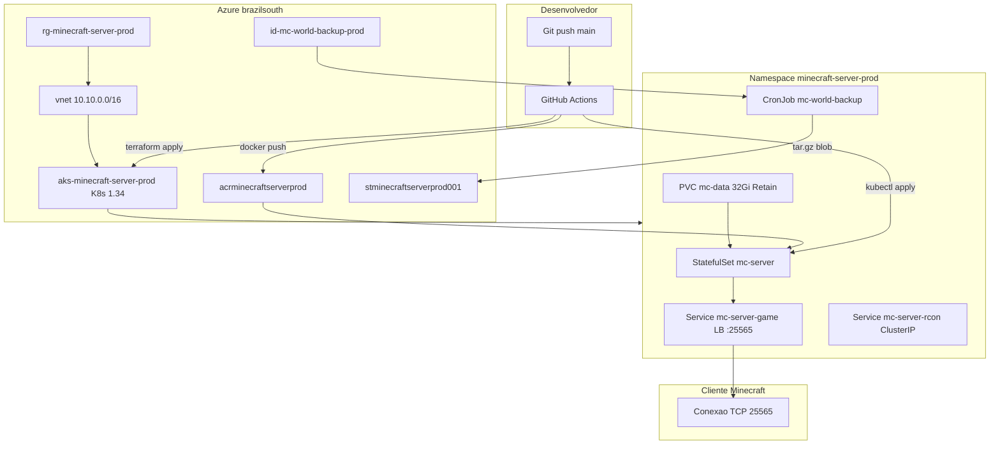
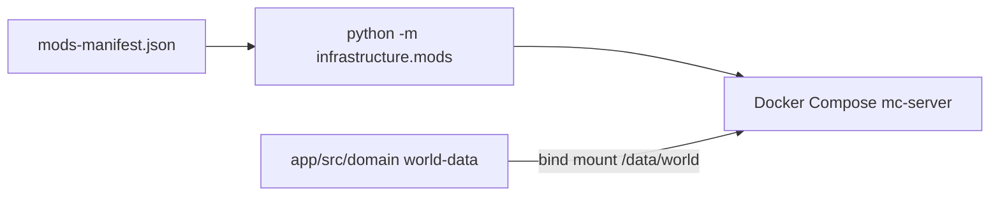

# Arquitetura

Visao da stack completa: codigo do repositorio, entrega local, infraestrutura Azure (Terraform), orquestracao Kubernetes e runtime do servidor Minecraft Fabric.

## Diagrama — producao (Azure AKS)



## Diagrama — desenvolvimento local



## Camadas do repositorio

| Camada | Pasta / artefato | Responsabilidade |
|--------|------------------|------------------|
| Dominio | `app/src/domain/world-data` | Persistencia do mundo (nao versionado no Git) |
| Aplicacao | `app/src/application/configs` | Politicas (`server.properties`) |
| Interface | `app/src/interface/mods`, `plugins` | Extensoes; JARs via sync |
| Infra app | `app/src/infrastructure/mods` | Download Modrinth/CurseForge |
| Infra app | `app/src/infrastructure/logging`, `database` | Logs e auth SQLite |
| Entrega local | `infra/docker/` | Dockerfile + Compose |
| IaC | `infra/terraform/live/prod` | AKS, ACR, rede, identidade backup |
| Runtime cloud | `infra/kubernetes/` | StatefulSet, servicos, backup, rede |

### Regra de dependencia (Clean Architecture)

- Codigo em `app/src/` nao depende de Terraform nem de YAML do Kubernetes
- Scripts e Makefile dependem de `src/`, nunca o contrario
- Manifestos K8s referenciam imagem do ACR e secrets injetados pelo CD

## Mapeamento de volumes

| Host (local) | Pod AKS | Caminho no container | Conteudo |
|--------------|---------|----------------------|----------|
| `app/src/domain/world-data` | subPath `world` | `/data/world` | Chunks, jogadores |
| `app/src/application/configs/server.properties` | ConfigMap | `/data/server.properties` | Politicas (K8s) |
| `app/src/interface/mods` | subPath `mods` | `/data/mods` | JARs Fabric |
| `app/src/interface/plugins` | subPath `plugins` | `/data/plugins` | Plugins |
| `app/src/infrastructure/logging` | subPath `logs` | `/data/logs` | Logs |
| `app/src/infrastructure/database` | subPath `database` | `/data/database` | SQLite / auth |

No AKS um unico PVC `mc-data` (32Gi, `mc-standard-ssd`, **Retain**) agrupa os subPaths.

## Servidor Minecraft (runtime)

| Parametro | Valor producao (StatefulSet) | Local (`.env`) |
|-----------|------------------------------|----------------|
| Versao | `1.20.6` | `MINECRAFT_VERSION` |
| Loader | `FABRIC` | `SERVER_TYPE` |
| Memoria | `2G` (limite pod 3Gi) | `MEMORY_LIMIT` |
| Porta jogo | `25565` | `GAME_PORT` |
| RCON | `25575` (ClusterIP no AKS) | `RCON_PORT` (localhost only) |
| Online mode | `false` | `ONLINE_MODE` |
| Whitelist | Secret `mc-access` | `MINECRAFT_WHITELIST` |
| Flags JVM | `USE_AIKAR_FLAGS=true` | idem |
| Probes | TCP `25565` startup/liveness/readiness | healthcheck `mc-health` |

Imagem base: `itzg/minecraft-server:java21`, estendida em `infra/docker/Dockerfile` e publicada como `minecraft-core-server:<tag>` no ACR.

## Infraestrutura Azure (Terraform)

Stack: `infra/terraform/live/prod` (regiao `brazilsouth`).

| Modulo | Recursos principais |
|--------|---------------------|
| `network` | VNet, subnet AKS `10.10.0.0/22`, NSG (Minecraft 25565, RCON opcional, egress) |
| `acr` | Registry Basic, pull via kubelet identity |
| `aks` | Cluster Free tier, 1x `Standard_D2s_v6`, OIDC + Workload Identity |
| `backup_identity` | UAMI `id-mc-world-backup-prod` + federated credential para SA `mc-world-backup` |

Storage account `stminecraftserverprod001` (pre-existente / backend): containers `tfstate` e `world-backups`.

Versao Kubernetes alinhada ao cluster em `variables.tf` (padrao `1.34`); o modulo AKS ignora drift de versao para evitar downgrade.

## Kubernetes (Kustomize)

| Caminho | Uso |
|---------|-----|
| `infra/kubernetes/base/` | Manifestos comuns (StatefulSet, PVC, Services, CronJob, NetworkPolicy) |
| `infra/kubernetes/overlays/prod/` | Patches de recursos, DNS label do LB, annotations detalhadas |

Patch `annotations-recursos.yaml` define ate 14 metadados essenciais por recurso (namespace, StatefulSet, Service game, CronJob backup).

Script `app/scripts/bash/atualizar-annotations-k8s.sh` preenche conectividade e saude apos deploy. Catalogo completo de chaves e diagramas: [annotations.md](annotations.md).

## CI/CD (resumo)

| Evento | Efeito |
|--------|--------|
| Push `main` | CI: lint, testes, seguranca, validacao TF/K8s/Docker; deploy infra se TF mudou; release semantica |
| Release publicada | CD: build imagem, push ACR, rollout AKS, annotations, testes |
| Workflow Destroy manual | Remove namespace K8s, plan/apply destroy Terraform |

Detalhes: [devops.md](devops.md) e [.github/README.md](../.github/README.md).

## Sync de mods

Manifesto: `app/src/interface/mods/mods-manifest.json`.

```bash
make docker-sync-mods
cd app && python -m pytest tests/unit/infrastructure/mods/test_sync.py
```

JARs nao entram no Git; CI e desenvolvedor rodam sync antes do build.

## Scorecard

| Pilar | Nota | Observacao |
|-------|------|------------|
| Separacao codigo / infra | 9/10 | Monorepo claro |
| Producao Azure | 8/10 | Single node; observabilidade metricas pendente |
| Persistencia | 9/10 | PVC Retain + backup blob diario |
| Seguranca padrao | 8/10 | Whitelist + online-mode; RCON nao exposto em LB |
| Metadados operacionais | 9/10 | Annotations `minecraft-server.io/*` |

Ver [principles.md](principles.md) e [roadmap.md](roadmap.md).
