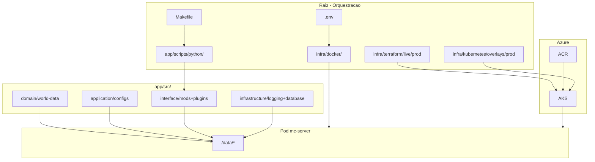

# Arquitetura e DDD

## Visao geral

O projeto separa **dados e configuracao do jogo** (`app/src/`) da **orquestracao de entrega** (`infra/`, Makefile, `app/scripts/`). Isso aproxima o layout de Clean Architecture e DDD estrutural, mesmo sem camada de aplicacao em Python dentro de `src/`.

## Clean Architecture



Entrega local: Docker Compose. Entrega cloud: Terraform provisiona AKS/ACR; Kubernetes monta os mesmos caminhos `/data/*` via PVC subPaths e ConfigMap.

### Mapeamento de volumes

| Host | Container | Modo | Camada |
|------|-----------|------|--------|
| `app/src/domain/world-data` | `/data/world` | rw | Dominio |
| `app/src/application/configs/server.properties` | `/data/server.properties` | ro | Aplicacao |
| `app/src/interface/mods` | `/data/mods` | rw | Interface |
| `app/src/interface/plugins` | `/data/plugins` | rw | Interface |
| `app/src/infrastructure/logging` | `/data/logs` | rw | Infraestrutura |
| `app/src/infrastructure/database` | `/data/database` | rw | Infraestrutura (auth/SQLite) |

### Regra de dependencia

- **Dominio** nao depende de nada externo ao estado do jogo
- **Aplicacao** define politicas (`server.properties`)
- **Interface** isola extensoes (mods/plugins)
- **Infraestrutura** persiste logs e aspectos operacionais
- **Scripts/Docker** dependem de `src/`, nunca o contrario

### Limitacoes atuais

| Aspecto | Situacao |
|---------|----------|
| Codigo Python em `src/` | `src/infrastructure/mods/` (sync, providers Modrinth/CurseForge) |
| Entrypoint fino | `app/scripts/python/sync_mods.py` e `python -m infrastructure.mods` |
| Templates no Dockerfile (`/templates/`) | Sobrescritos por bind mounts em runtime |
| Camada Presentation | Nao aplicavel (sem UI/API HTTP) |

## DDD (Domain-Driven Design)

### Contexto delimitado

**Servidor Minecraft Fabric** — hospedar mundo, mods versionados e configuracao de jogo via container.

### Linguagem ubiqua

| Termo | Significado no projeto |
|-------|------------------------|
| Mundo | Dados em `src/domain/world-data` |
| Manifesto | `mods-manifest.json` (lockfile de dependencias) |
| Sync | Download idempotente de JARs via `infrastructure.mods` |
| Modo hibrido | `online-mode=false` (original + offline) |

### Bounded contexts (pastas)

- **Domain**: agregado de persistencia do mundo (dados, nao codigo)
- **Application**: politicas de servidor (`server.properties`)
- **Interface**: adapters de extensao (mods/plugins)
- **Infrastructure**: logging e integracao externa (Modrinth API via script)

### DDD tatico

Nao ha entidades, value objects ou repositorios implementados em codigo. O DDD aqui e **organizacional** (pastas + manifesto como anti-corruption layer para Modrinth/CurseForge).

### Estrategia de mods (lockfile)

```json
{
  "schema_version": 1,
  "minecraft_version": "1.20.6",
  "loader": "fabric",
  "mods": [
    {
      "id": "fabric-api",
      "version": "0.100.8+1.20.6",
      "source": "modrinth",
      "project_slug": "fabric-api",
      "sha256": "",
      "download_url": ""
    }
  ]
}
```

- JARs **nao** entram no Git principal
- CI/local roda `python -m infrastructure.mods` antes do `up`
- Atualizacoes de mods em **branch separada**, testadas antes do merge

## Scorecard arquitetural

| Pilar | Nota | Observacao |
|-------|------|------------|
| Clean Architecture | 7/10 | Pastas corretas; codigo concentrado em `scripts/python/` |
| DDD estrutural | 7/10 | Contexto claro; sem DDD tatico em codigo |
| Isolamento de dados | 9/10 | Bind mounts + `.gitignore` adequados |

Ver tambem [principles.md](principles.md) e [roadmap.md](roadmap.md).
