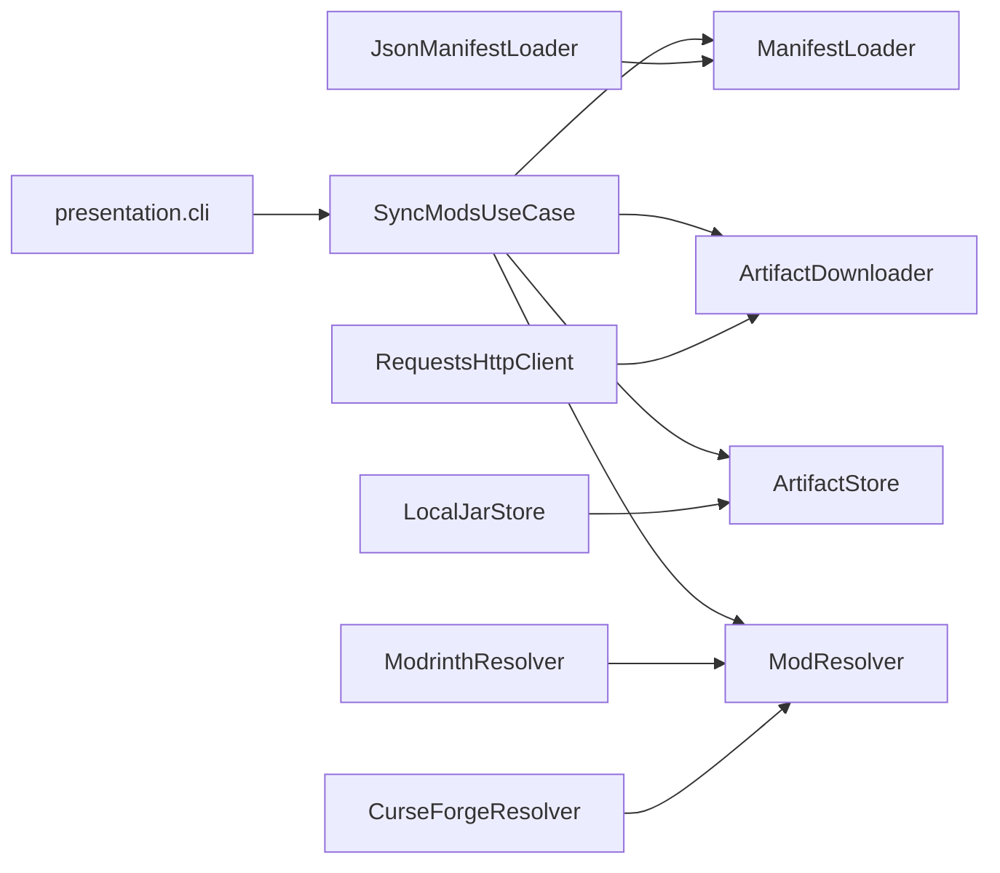

# Arquitetura da aplicacao

Camadas hexagonais do codigo Python que sincroniza mods Fabric a partir de um manifesto. A stack Azure/AKS permanece em [architecture.md](architecture.md).

## Dominio

Sincronizar JARs listados em `app/runtime/mods/mods-manifest.json` (Modrinth ou CurseForge), validar SHA-256 e gravar em `app/runtime/mods/`.

Entrada principal: CLI (`python run.py` ou `python -m presentation.cli`).

## Camadas

| Camada | Pacote | Responsabilidade |
|--------|--------|------------------|
| domain | `domain.entities`, `domain.services` | Manifesto, entrada de mod, artefato de download, nome do JAR, checksum |
| application | `application.ports`, `application.use_cases` | `SyncModsUseCase` e contratos (`ManifestLoader`, `ModResolver`, `ArtifactStore`, `ArtifactDownloader`) |
| infrastructure | `infrastructure.adapters`, `config`, `logging` | JSON, HTTP `requests`, filesystem, Settings, `log_event` |
| presentation | `presentation.cli`, `presentation.logging` | Composition root, exit code, eventos de log |

`app/runtime/` nao e camada DDD: e persistencia do servidor Fabric (mundo, configs, JARs, logs, database).

## Fluxo

1. CLI carrega `Settings` (env / `.env`, respeitando `SYNC_DISABLE_DOTENV`).
2. Composition root liga adapters ao use case.
3. Use case carrega o manifesto, resolve URL+hash, reutiliza JAR valido ou baixa de novo.
4. CLI emite `mods.sync.run.started` / `finished` / `failed` e retorna 0 ou 1.

## Ports e adapters

| Port | Adapter |
|------|---------|
| `ManifestLoader` | `JsonManifestLoader` |
| `ModResolver` | `ModrinthResolver`, `CurseForgeResolver` |
| `ArtifactStore` | `LocalJarStore` |
| `ArtifactDownloader` | `RequestsArtifactDownloader` |

CurseForge exige `download_url` no manifesto (sem API key neste recorte).

## Configuracao

| Variavel | Papel |
|----------|--------|
| `SYNC_DISABLE_DOTENV` | Isola testes do `.env` local |
| `MODS_MANIFEST_PATH` | Caminho do manifesto |
| `MODS_DIR` | Destino dos JARs |
| `LOG_LEVEL` | Nivel do logger da CLI |
| `SYNC_USER_AGENT` | User-Agent HTTP |
| `REPO_ROOT` | Raiz do repositorio |

Template sem segredos: [`.env.example`](../.env.example). Compose local continua em `infra/docker/.env`.

## Regras

- `domain` e `application` nao importam `infrastructure` nem `presentation` (gate no orquestrador).
- Use case nao logam e nao usam `requests`.
- Validacao de entidades no dominio.
