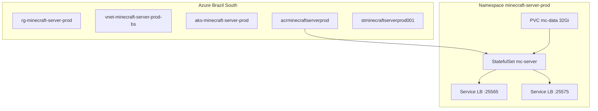

# Azure AKS - Infraestrutura e Deploy

Guia de infraestrutura como codigo (Terraform) e manifestos Kubernetes para executar o servidor Minecraft no Microsoft Azure (`brazilsouth`).

## Arquitetura



## Estrutura do repositorio

```text
infra/terraform/
  modules/
  live/prod/

infra/kubernetes/
  base/
  overlays/prod/
```

## Pre-requisitos

- Azure CLI (`az login`)
- Terraform >= 1.6
- kubectl
- kustomize (incluso no kubectl)
- Permissoes: Contributor na subscription + Storage Blob Data Contributor no state

## 1. Deploy da infraestrutura

O remote state Terraform fica no mesmo resource group e storage account da producao (`rg-minecraft-server-prod` / `stminecraftserverprod001`, container `tfstate`).

```bash
cd infra/terraform/live/prod
cp terraform.tfvars.example terraform.tfvars
```

Ajuste `admin_cidr_list` com seu IP publico (`curl -s ifconfig.me`/32).

```bash
terraform init
terraform plan
terraform apply
```

Obtenha credenciais do cluster:

```bash
az aks get-credentials --resource-group rg-minecraft-server-prod --name aks-minecraft-server-prod
```

## 2. Imagem no ACR

```bash
ACR=$(terraform -chdir=infra/terraform/live/prod output -raw acr_login_server)
az acr login --name acrminecraftserverprod
docker build -t "${ACR}/minecraft-core-server:v1.0.0" .
docker push "${ACR}/minecraft-core-server:v1.0.0"
```

## 3. Deploy Kubernetes

Altere a senha RCON antes do apply:

```bash
kubectl create namespace minecraft-server-prod --dry-run=client -o yaml | kubectl apply -f -
kubectl -n minecraft-server-prod create secret generic mc-rcon \
  --from-literal=RCON_PASSWORD='sua-senha-forte' \
  --dry-run=client -o yaml | kubectl apply -f -
```

Consulte `infra/kubernetes/base/secret-rcon.yaml.example` (nao commitar senha real).

```bash
kubectl apply -k infra/kubernetes/overlays/prod
```

## 4. Migracao do mundo

Copie dados locais para o pod:

```bash
POD=$(kubectl -n minecraft-server-prod get pod -l app.kubernetes.io/name=mc-server -o jsonpath='{.items[0].metadata.name}')
kubectl -n minecraft-server-prod cp app/src/domain/world-data/. "${POD}:/data/world/"
```

## 5. Validacao

```bash
bash app/scripts/bash/test-aks.sh
```

IP do jogo (hostname Azure gratuito alocado dinamicamente pelo AKS):

```bash
kubectl -n minecraft-server-prod get svc mc-server-game
```

Conecte no cliente Minecraft usando o FQDN exibido nas anotações/status do Service (porta padrão 25565). Detalhes: [docs/access-and-hostname.md](../docs/access-and-hostname.md).

## Custos estimados (prod minimo)

| Recurso | SKU | Nota |
|---------|-----|------|
| AKS control plane | Free tier | Sem cobranca de gerenciamento |
| Node pool | 1x Standard_B2s | Principal custo fixo |
| Disco PVC | StandardSSD 32Gi | Mundo + mods + logs |
| Load Balancer | Standard | 1-2 IPs publicos |
| ACR | Basic | Armazenamento de imagem |

Use creditos Azure iniciais para homologacao. Spot nodes apenas em ambientes nao-prod.

## Seguranca

Guia completo: [access-and-hostname.md](access-and-hostname.md)

- Whitelist + `online-mode=true` (conta Mojang obrigatoria)
- RCON via `kubectl port-forward svc/mc-server-rcon 25575:25575` (ClusterIP)
- NSG opcional: `game_cidr_list` e `admin_cidr_list` no Terraform
- Hostname gratuito: `minecraftserverprod.brazilsouth.cloudapp.azure.com`

## Qualidade (Terraform)

```bash
terraform fmt -recursive infra/terraform/
tflint --init && tflint --recursive --config linters/.tflint.hcl
tfsec --config-file linters/.tfsec.yml .
```

Hooks pre-commit e job CI `Terraform - Validate` executam as mesmas checagens.
