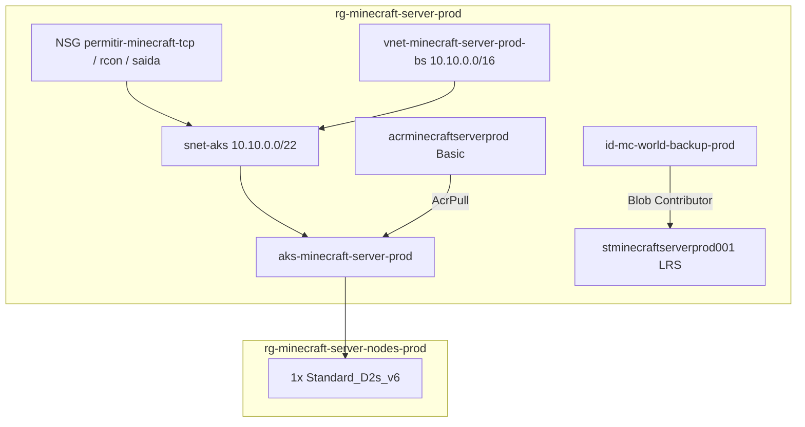

# Azure e AKS

Guia de infraestrutura como codigo (Terraform), manifestos Kubernetes (Kustomize) e operacao do servidor Minecraft em **Microsoft Azure** (`brazilsouth`).

## Arquitetura de recursos



## Inventario

| Recurso | Nome / valor | Notas |
|---------|--------------|-------|
| Regiao | `brazilsouth` | `locals.tf` |
| Resource group | `rg-minecraft-server-prod` | Pre-existente; data source |
| VNet | `vnet-minecraft-server-prod-bs` | `10.10.0.0/16` |
| Subnet AKS | `snet-aks-minecraft-server-prod-bs` | `10.10.0.0/22` |
| AKS | `aks-minecraft-server-prod` | Tier Free, K8s **1.34**, OIDC + Workload Identity |
| Node pool | `default` | 1 no, VM **Standard_D2s_v6**, disco OS 64Gi |
| ACR | `acrminecraftserverprod` | SKU Basic, admin desabilitado |
| Storage | `stminecraftserverprod001` | `tfstate` + `world-backups` |
| DNS label (LB K8s) | `minecraftserverprod` | Annotation no Service `mc-server-game` |
| FQDN esperado | `minecraftserverprod.brazilsouth.cloudapp.azure.com` | Apos LB provisionar |

## Estrutura Terraform

```text
infra/terraform/
  modules/
    acr/          Container Registry
    aks/          Cluster + AcrPull + OIDC/WI
    network/      VNet, subnet, NSG
  live/prod/
    main.tf       network, acr, aks
    backup_identity.tf
    variables.tf  kubernetes_version padrao 1.34
    outputs.tf
    providers.tf  backend azurerm em stminecraftserverprod001
```

Bootstrap do state: `infra/terraform/bootstrap/` (uso inicial).

## Pre-requisitos

- Azure CLI (`az login`)
- Terraform >= 1.6
- kubectl + Kustomize (incluso no kubectl)
- Permissoes: Contributor na subscription; **Storage Blob Data Contributor** no container `tfstate` para o backend
- GitHub OIDC configurado para CI/CD (ver [.github/README.md](../.github/README.md))

## 1. Deploy da infraestrutura

O CI/CD e o script `app/scripts/bash/ensure-tfstate-backend.sh` criam o resource group, a storage account e os containers `tfstate` e `world-backups` antes do `terraform apply`.

Remote state: `stminecraftserverprod001` / container `tfstate` / key `minecraft/prod.terraform.tfstate`.

```bash
cd infra/terraform/live/prod
cp terraform.tfvars.example terraform.tfvars
```

Edite `terraform.tfvars`:

```hcl
subscription_id = "<sua-subscription>"
tenant_id       = "<seu-tenant>"
kubernetes_version = "1.34"
admin_cidr_list = ["<seu-ip-publico>/32"]
game_cidr_list  = []
game_dns_label  = "minecraftserverprod"
```

`admin_cidr_list` habilita regra NSG para RCON (25575) apenas dos CIDRs listados. `game_cidr_list` vazio permite Minecraft de qualquer origem (whitelist no servidor continua obrigatoria).

```bash
terraform init
terraform plan
terraform apply
az aks get-credentials --resource-group rg-minecraft-server-prod --name aks-minecraft-server-prod
```

Outputs uteis:

```bash
terraform output aks_cluster_name
terraform output acr_login_server
terraform output world_backup_identity_client_id
terraform output game_dns_label
```

## 2. Imagem no ACR

```bash
ACR_LOGIN=$(terraform -chdir=infra/terraform/live/prod output -raw acr_login_server)
az acr login --name acrminecraftserverprod
docker build -f infra/docker/Dockerfile -t "${ACR_LOGIN}/minecraft-core-server:v1.0.0" .
docker push "${ACR_LOGIN}/minecraft-core-server:v1.0.0"
```

Em producao o CD faz build e push automaticamente na release (tag semantica, sem `latest`).

## 3. Deploy Kubernetes

Secrets obrigatorios (CD ou manual):

```bash
kubectl apply -f infra/kubernetes/base/namespace.yaml
kubectl -n minecraft-server-prod create secret generic mc-rcon \
  --from-literal=RCON_PASSWORD='sua-senha-forte' \
  --dry-run=client -o yaml | kubectl apply -f -
kubectl -n minecraft-server-prod create secret generic mc-access \
  --from-literal=WHITELIST='nick1,nick2' \
  --dry-run=client -o yaml | kubectl apply -f -
```

Exemplos versionados (sem valores reais): `secret-rcon.yaml.example`, `secret-access.yaml.example`.

```bash
make k8s-apply
make k8s-annotate
```

Ou apenas:

```bash
kubectl apply -k infra/kubernetes/overlays/prod
bash app/scripts/bash/atualizar-annotations-k8s.sh
```

## 4. Conectar no jogo

Consulte o endereco nas annotations (recomendado):

```bash
kubectl -n minecraft-server-prod get svc mc-server-game \
  -o jsonpath='{.metadata.annotations.minecraft-server\.io/conectividade-endereco}{"\n"}'
```

Hostname Azure (quando LB usa DNS label):

```text
minecraftserverprod.brazilsouth.cloudapp.azure.com
```

Porta padrao **25565** (sem sufixo `:25565` em hostnames DNS).

Guia de acesso e whitelist: [access-and-hostname.md](access-and-hostname.md).

## 5. Migracao do mundo

Com pod em execucao:

```bash
POD=mc-server-0
kubectl -n minecraft-server-prod cp app/src/domain/world-data/. "${POD}:/data/world/" -c mc-server
```

## 6. Validacao

```bash
make k8s-test
```

Ou:

```bash
bash app/scripts/bash/test-aks.sh
```

## Backup automatico

| Item | Valor |
|------|-------|
| CronJob | `mc-world-backup` |
| Horario | 03:00 `America/Sao_Paulo` |
| Origem | `/data/world` no pod `mc-server-0` |
| Destino | container `world-backups` em `stminecraftserverprod001` |
| Auth | Workload Identity `id-mc-world-backup-prod` |

Requer `terraform apply` em `live/prod` (recurso `backup_identity.tf`) antes do primeiro backup bem-sucedido.

```bash
kubectl -n minecraft-server-prod get cronjob mc-world-backup
kubectl -n minecraft-server-prod create job --from=cronjob/mc-world-backup test-backup-manual
```

## Disco persistente (Retain)

StorageClass `mc-standard-ssd`: `reclaimPolicy: Retain`.

Se o PVC ou StatefulSet for removido, o disco gerenciado **permanece** no Azure (custo continua). Exclua manualmente no portal apos backup se necessario.

## Rede e seguranca

| Porta | Exposicao | Controle |
|-------|-----------|----------|
| 25565 | LoadBalancer publico | NSG opcional (`game_cidr_list`) + whitelist + online-mode |
| 25575 | ClusterIP apenas | `kubectl port-forward`; NSG admin opcional |

NetworkPolicy no namespace restringe trafego dos pods (ingress jogo/RCON interno, egress DNS/HTTPS).

## Custos estimados (prod minimo)

| Recurso | SKU | Nota |
|---------|-----|------|
| AKS control plane | Free | Sem taxa de gerenciamento |
| Node | 1x Standard_D2s_v6 | Principal custo fixo |
| Disco PVC | StandardSSD 32Gi | Retain se apagar PVC |
| Load Balancer | Standard | IP publico do jogo |
| ACR | Basic | Imagens |
| Blob backup | LRS | Centavos por GB/mes |
| Workload Identity | Incluso | Sem custo extra |

## Observabilidade

Exporter Prometheus / sidecar **nao** incluido (economia de RAM no unico node). Saude operacional via probes TCP, logs e annotations `minecraft-server.io/saude-*`. Ver [devops.md](devops.md) (roadmap prioridade 6 — metricas).

## Qualidade Terraform

```bash
make ci-fmt
terraform -chdir=infra/terraform/live/prod validate
```

CI executa tflint, tfsec e validate (ver [devops.md](devops.md)).

## Destroy

Workflow GitHub **Destroy** (manual, confirmar `DESTROY`):

1. Remove namespace `minecraft-server-prod` (libera LB)
2. Remove cluster AKS e resource group de nodes
3. `terraform plan -destroy` / `apply` (recursos gerenciados pelo Terraform)
4. Remove `rg-minecraft-server-prod` e `rg-minecraft-server-nodes-prod` (storage, tfstate e restolhos)

Local: `bash app/scripts/bash/teardown-azure-stack.sh` apos limpar o que o Terraform gerencia.

Ver [operations.md](operations.md).
